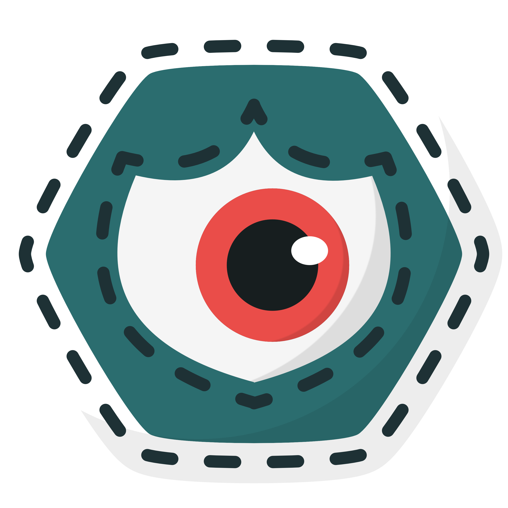

<p align="center">
  
</p>

# EdgeCV4Safety: AI-Driven Contextual Safety System for Industry 4.0/5.0

<br>

## 1. System Overview and Objective 🎯

This project implements a **modular and scalable Computer Vision (CV) system** designed to replace traditional physical barriers, enhancing **worker safety** in industrial settings (Industry 4.0/5.0). The core objective is to achieve **contextual control** of machinery based on the dynamic state of the surrounding work environment.

The system continuously monitors a defined workspace. Upon the detection of personnel entering this area, appropriate countermeasures are instantly triggered, influencing machinery behavior to prevent hazardous situations. This compartmentalized architecture promotes high **modularity and scalability**.


<br>

## 2. Architectural Components and Design Choices ️️⚙

The architecture is built on flexible components, ensuring low-latency processing critical for safety applications.

### 2.1. Sensing: Industrial Camera

For flexible and high-performance monitoring, the system utilizes **Industrial Cameras**.

* **Flexibility & Performance:** The camera can be positioned dynamically within the workspace while providing the necessary data quality for vision processing.
* **Protocol:** Data is transmitted over a standard network using the **GigE Vision protocol** to ensure stable and responsive data streaming.

### 2.2. Data Processing: Edge Computing

Effective workspace monitoring requires sophisticated data processing. This computation is realized on powerful hardware situated **on-site**, leveraging the **Edge Computing** paradigm to guarantee the low-latency required for real-time safety.

* **Human Recognition:** A **fast and efficient ONNX object detection model (YOLO11)** identifies the presence of personnel.
* **Contextual Awareness:** **High-performance ONNX depth estimation models (UniDepth v2 or DepthAnything v2)** are used to calculate distances, enabling more granular control responses.
* **Hardware & Portability:** By converting models to the **ONNX runtime format**, is ensured **hardware-agnostic deployment**. The system is optimized to achieve the best performance with the available hardware and optimisations.

### 2.3. Control and Action: The Safety Logic Core

Based on the computed results (detection and distance), a core logic module interprets the data and transmits **new directives** to the industrial machinery.

* **Use Case:** The system manages the speed of a **Universal Robots robotic arm** by sending new velocity values (using the **RTDE protocol**) to dynamically increase, decrease, or stop the robot, ensuring safety based on the worker's position.


<br>

## 3. System Architecture and Flow 📐

The architecture operates under the **Edge Continuum** principle to guarantee real-time performance.

### 3.1. General Architecture

The overall system architecture is conceptually represented below, illustrating the relationship between sensing, processing, and control elements.

<p align="center">
  
  <br>
  <i>Fig. 13 - General System Architecture.</i>
</p>
Figure 1 illustrates a single compute node for clarity. For enhanced scalability, modularity, and to reduce the computational load on the CV system, the architecture is designed to support a dedicated decision-making node.

### 3.2. Functional Flow

The functional flow illustrates the complete, contextually driven sequence from data acquisition to the final control action:

<p align="center">
  
  <br>
  <i>Fig. 2 - Functional Flow of the Architecture.</i>
</p>


<br>

## 4. Optional Scalability Feature: Time-Sensitive Networking (TSN) 🌍

For future scalability or in highly distributed environments requiring deterministic timing guarantees, the system is prepared for integration with the **Time-Sensitive Networking (TSN)** protocol.

* **TSN Benefit:** The implementation of TSN (requiring a specialized switch and camera support) would provide **deterministic latency** and prioritize data flow, further strengthening the system's real-time performance for safety-critical applications.

<br>

## 5. Project Structure and Modularity 📂

This repository serves as the **super-repository** for the EdgeCV4Safety project, utilizing Git Submodules to maintain strict modularity between the processing and control components.

The complete system is divided into two distinct, independently managed components:

| Component | Description | Local Directory | Repository Link |
| :--- | :--- | :--- | :--- |
| **Vision Processing** | Code for camera interfacing, Deep Learning inference (YOLO, UniDepth/DepthAnything), and safety zone determination. | `vision_processing/` | [GitHub Repository: Vision](https://github.com/justwhiteecode/EdgeCV4Safety-Vision) |
| **Robot Controller** | Logic for decision-making, speed calculation, and communication with the Universal Robots arm via RTDE protocol. | `robot_controller/` | [GitHub Repository: Controller](https://github.com/justwhiteecode/EdgeCV4Safety-Controller) |

*The specific documentation for each submodule is available on respective pages.*

<br>

## 6. Cloning and Setup Instructions 🛠

### 6.1. Cloning the Full Project

To clone the main repository and **automatically download the contents of both submodules**, use the `--recurse-submodules` flag:

```bash
git clone --recurse-submodules https://github.com/justwhiteecode/EdgeCV4Safety.git
cd EdgeCV4Safety
```

### 6.2. Updating Existing Clones
If you have already cloned the repository without the --recurse-submodules flag, you can initialize and download the submodules manually:

```bash
git submodule update --init --recursive
```

### 6.3. Initial Setup by Component

After cloning, please refer to the specific setup instructions within each submodule directory for dependency installation:

* Vision System Setup: See the README.md and requirements.txt in the vision_processing/ directory.

* Controller System Setup: See the README.md and requirements.txt in the robot_controller/ directory.
