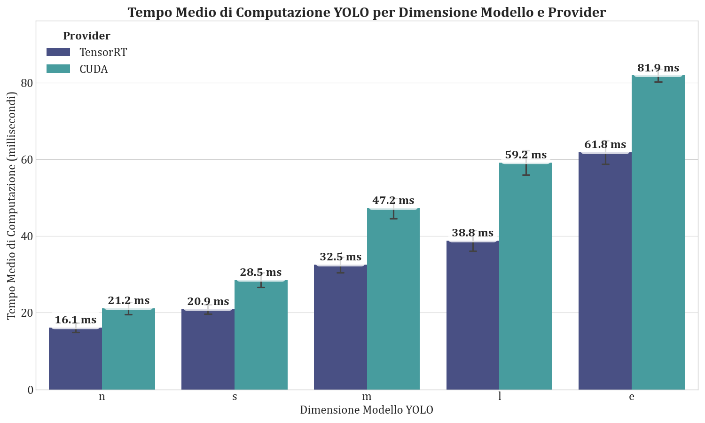
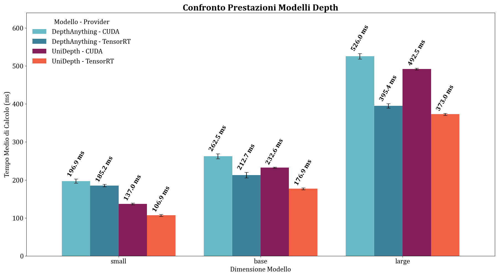
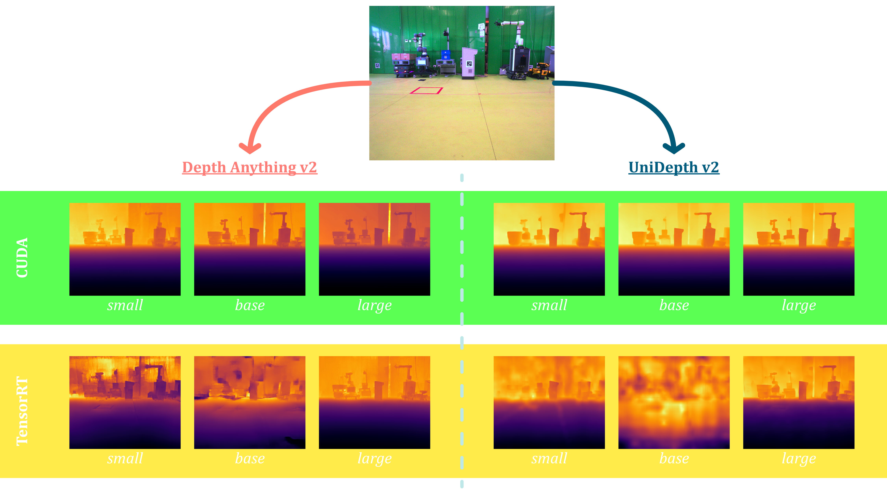
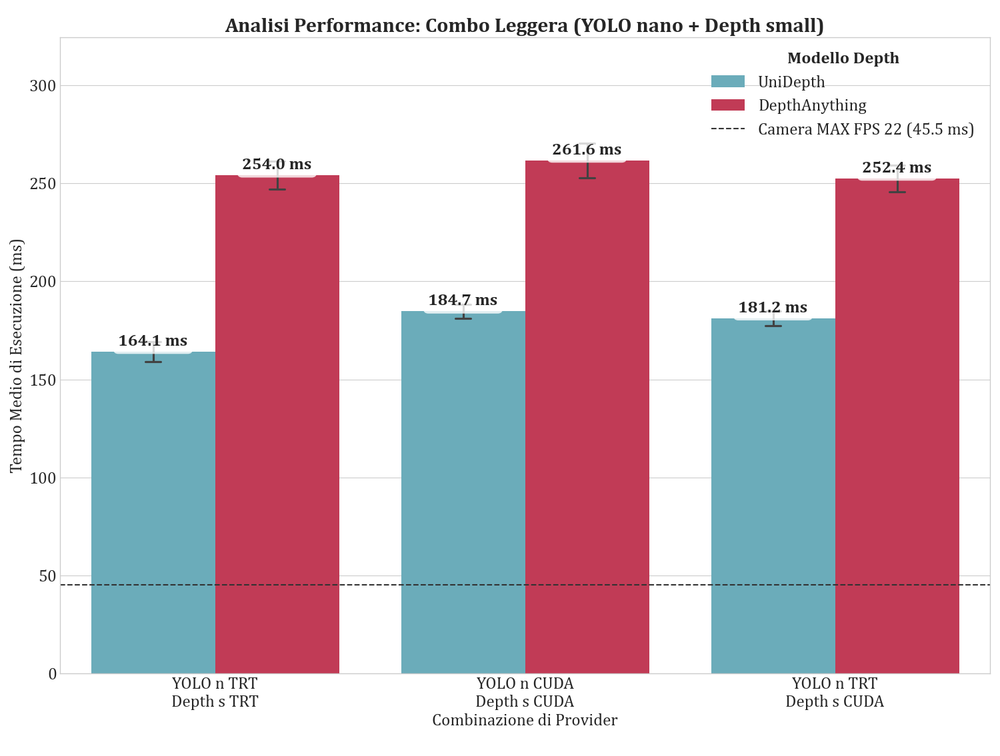
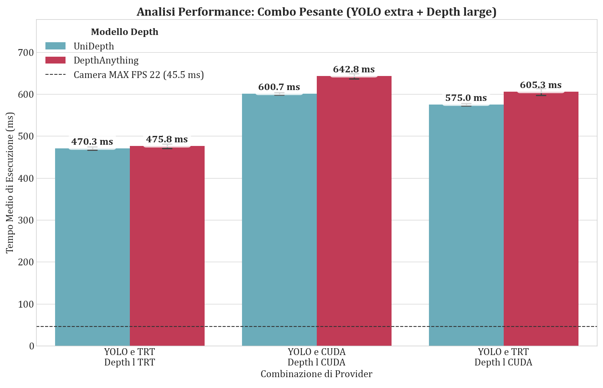
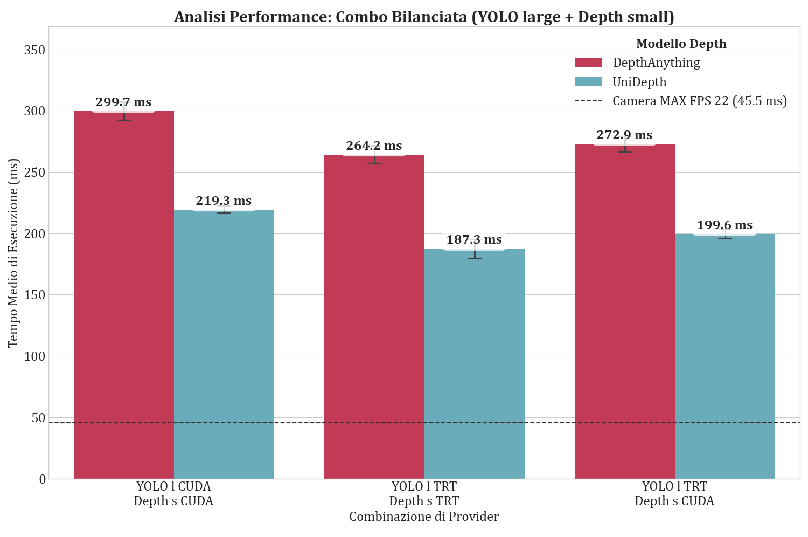

# Vision Submodule: A Real-Time 3D Computer Vision System
This submodule, part of the [EdgeCV4Safety](https://github.com/justwhiteecode/EdgeCV4Safety.git), implements an advanced computer vision system for real-time 3D perception. Using an industrial camera (via Aravis), the system performs 2D object detection and metric depth estimation to locate objects in 3D space and calculate their distance.

The architecture is designed to be **modular, high-performance, and cross-platform** thanks to the exclusive use of ONNX models, accelerated by the available hardware.

## Key Features 🌟
* **Real-Time 2D Object Detection**: Utilizes a **YOLO11** model in ONNX format for fast and accurate object identification.
* **Monocular Metric Depth Estimation**: Calculates the distance of each pixel from the camera in meters.
* **Interchangeable Depth Models**: Allows for dynamic selection between two powerful, state-of-the-art depth estimation models:
  * [**UniDepth v2**](https://doi.org/10.48550/arXiv.2502.20110): A Vision Transformer-based model, renowned for its accuracy and its ability to infer camera parameters from the image context .
  * [**Depth Anything v2**](https://doi.org/10.48550/arXiv.2406.09414): Another robust model, highly efficient and well-suited for indoor scenes.
* **Cross-Platform Compatibility**: Thanks to ONNX Runtime, the system is hardware-agnostic. It runs on:
  * **NVIDIA Jetson** platforms (leveraging **TensorRT** for maximum performance).
  * PCs with **NVIDIA GPUs** (leveraging **CUDA** or **TensorRT**).
  * Windows PCs with** AMD/Intel GPUs** (leveraging **DirectML**).
  * Any machine with a **CPU**, as a universal fallback.
* **Industrial Camera Integration**: Acquires video streams from GigE Vision or even USB3 Vision cameras using the [Aravis library](https://github.com/AravisProject/aravis.git).
* **UDP Data Streaming**: Sends relevant data (like the minimum distance to an object) to another node on the network via UDP sockets, to communicate to the controller node data to make decisions on.

<p align="center">
  
  <br>
  <i>Fig. 1 - Functional Flow of the Vision submodule.</i>
</p>

<br>

## Files Breakdown 📂
The project is divided into clear, specialized modules:
* `run_cv.py`: The **main script** and application entry-point. It manages the main loop: frame capture, model coordination, visualization, and result data streaming.
* `detection_model.py`: Contains the `ObjectDetector` class, which encapsulates all logic for loading and running the YOLO11 ONNX model, supporting different model sizes (`"nano"`, `"small"`, `"medium"`, `"large"`, `"extra"`).
* `depth_model_depthanything.py`: Contains the `DepthEstimatorDepthAnything` class for the Depth Anything v2 model, supporting different model sizes (`"small"`, `"base"`, `"large"`).
* `depth_model_unidepth_onnx.py`: Contains the `DepthEstimatorUniDepthONNX` class for the UniDepth v2 model, supporting different model sizes (`"small"`, `"base"`, `"large"`)..
* `bbox3d_utils.py`: Provides utility functions for visualizing 3D bounding boxes and the Bird's Eye View.
* `models/`: (Recommended) A folder to store all `.onnx` model files. For GitHub restrictions, only the lighter models are available by cloning the repo. A few other models can be found on [our HuggingFace page](https://huggingface.co/justwhitee/EdgeCV4Safety-Models/tree/main) (not all sizes have been compiled).

<br>

## Setup and Installation 🔧
### 1. System Prerequisites
Before installing Python dependencies, ensure the [Aravis library](https://github.com/AravisProject/aravis.git) is installed on your system. 

On **Debian/Ubuntu-based** systems:
 ```bash
git clone https://github.com/AravisProject/aravis.git
cd aravis
meson setup build
cd build
ninja
ninja install
sudo ldconfig
```
For other platforms, follow the compilation instructions from the [official Aravis website](https://aravisproject.github.io/aravis/aravis-stable/building.html).

Installation of meson and ninja dependencies (if needed):
```bash
sudo apt install libxml2-dev libglib2.0-dev cmake libusb-1.0-0-dev gobject-introspection \
                 libgtk-3-dev gtk-doc-tools  xsltproc libgstreamer1.0-dev \
                 libgstreamer-plugins-base1.0-dev libgstreamer-plugins-good1.0-dev \
                 libgirepository1.0-dev gettext
```
Installation of meson and ninja (if needed):
```bash
sudo apt-get update
sudo apt install meson ninja-build -y
```

### 2. Install requirements:
1) First of all, the system was created and tested with Python 3.8, but it should also work with newer versions (check compatibility of requirements among versions).

2) Install Python required libraries from the submodule directory `vision_processing/`:
   ```bash
   pip3 install -r requirements.txt
   ```
3) Install ONNX runtime. This installation is critical and depends on your hardware. For any doubts, check [documentation](https://onnxruntime.ai/docs/install/).
    
    * For **CPU only** sysyems:
      ```bash
      pip3 install onnxruntime
      ```
      
    * For **NVIDIA GPUs** (Desktop PCs):
      ```bash
      pip3 install onnxruntime-gpu
      ```
    
    * For **NVIDIA Jetson**: Follow the official NVIDIA instructions to install the version optimized for JetPack. Some resources are available [here](https://elinux.org/Jetson_Zoo#ONNX_Runtime) and [here](https://pypi.jetson-ai-lab.io/jp6/cu126).
      ```bash
      # Download pip wheel from location above for your version of JetPack
      wget https://nvidia.box.com/shared/static/iizg3ggrtdkqawkmebbfixo7sce6j365.whl -O onnxruntime_gpu-1.16.0-cp38-cp38-linux_aarch64.whl
      
      # Install pip wheel
      pip3 install onnxruntime_gpu-1.16.0-cp38-cp38-linux_aarch64.whl
      ```

   _Note_: To run the application with UniDepth on TensorRT, you will need to have a recent version of TensorRT software due to operations that are not available on older versions. You need at least 8.6. For YOLO and DepthAnything, there are no relevant requirements (except `requirements.txt`).  

### 3. Model Download and Conversion
**Download** or convert the required **ONNX models** and place them in the project directory `models/`. Paths are mapped in the code in the respective class and file (`depth_model_*.py` and `detection_model.py`), particularly in the `model_map` object in the first part of the script, like: 
```python
model_map = {
            'small': './models/unidepthv2s.onnx', # you can change the file name like './models/unidepthv2_small_simplified.onnx'
            'base': './models/unidepthv2b.onnx',
            'large': './models/unidepthv2l.onnx'
        }
```
Some models are already present on [our repo](https://huggingface.co/justwhitee/EdgeCV4Safety-Models/tree/main) created for this purpose on HuggingFace.

If you want to compile by your own other sizes or even models that are not available on this repo or on HF, you can follow the following steps.

* For **YOLO**:
  1) Install requirements (with `pip3`). You can find them on [ultralytics page](https://github.com/ultralytics/ultralytics).
  2) Install `ultralytics`
     ```bash
     pip3 install ultralytics
     ```
  3) Export ONNX model, where `model` must be in the form `yolo11[n|s|m|l|x]`
     ```bash
     yolo export model=yolo11n.pt format=onnx opset=12
     ```
  *Note: Sometimes in the process of compiling the ONNX version, the system will update `onnxruntime`, resulting in the loss of the GPU version (if you had it). So you have to uninstall (`pip3 uninstall onnxruntime onnxruntime-gpu`) and then reinstall it from scratch following section (2.)*

* For **UniDepth v2**:
  1) Clone the [repository](https://github.com/lpiccinelli-eth/UniDepth.git)
  2) Install all the requirements. *Note that you will need at least Python 3.10 (we suggest it or 3.11 for stability), so you could get advantages by creating a virtual environment (the UniDepth repository describes how to get it).*
  3) Run the script inside the main directory of the repository
     ```bash
     python3.10 ./unidepth/models/unidepthv2/export.py --version v2 --backbone vitl --shape 462 616 --output-path unidepthv2.onnx
     ```
     *Note that camera height and width must be a multiple of 14 (the script should accommodate your values), and model sizes available are "vits", "vitb", "vitl"*. Feel free to change the `output-path`.

* For **DepthAnything v2**:
  1) Install ONNX and onnxruntime (_see [installation section](https://github.com/justwhiteecode/EdgeCV4Safety-Vision/tree/master?tab=readme-ov-file#2-install-requirements)_)
     ```bash
     pip3 install onnx onnxruntime
     ```
  2) Clone [this repository](https://github.com/fabio-sim/Depth-Anything-ONNX.git) for the conversion.
  3) Run the `dynamo.py` script inside the main directory of the repository. You can change the dimension (vits, vitb, vitl),
     eventually the supported image size, and the metric ambient (indoor or outdoor). _Also, relative models are available._
     Check for requirements on the official [Depth Anything v2 repository](https://github.com/DepthAnything/Depth-Anything-V2.git) and for parameters on the documentation of the [conversion repository](https://github.com/fabio-sim/Depth-Anything-ONNX.git). 
     ```bash
     python3 dynamo.py export --encoder vits --metric indoor -o depth_anything_v2_metric_indoor_small.onnx
     ```

 _Extra tip_: You can try to perform some optimisations on your ONNX models using `onnx-simplifier` (you can install it with pip: `pip install onnx-simplifier`):
 ```bash
 onnxsim input_model.onnx output_model_simplified.onnx
 ```
 
*Note: You do not need to compile the ONNX model on the same machine where it will be used, as ONNX files are agnostic. 
However, to compile these files, you *have to first install all the requirements* for the specific model you are converting.*

For conversion, but maybe also for deployment purposes, it could be useful to use Docker with an appropriate image. For development and our tests with a Jetson AGX Orin, we used [dustynv/l4t-pytorch:r35.3.1](https://hub.docker.com/layers/dustynv/l4t-pytorch/r35.2.1/images/sha256-431d88d9124310f8932f63bbadfaa8c88167c0035225c2df5e4392ce74d32c38)
image. You can find more images from dustynv [here](https://hub.docker.com/r/dustynv/l4t-pytorch/tags).

<br>

## Configuration and Usage 🛠️
There are a bunch of parameters that can be changed in order to achieve your goals. They are all in the first part of the main script (`run_cv.py`). 
Can be set:
* **Depth estimation model** (DepthAnything v2 or UniDepth v2) and **size** (small, base, large).
  ```python
  DEPTH_MODEL_CHOICE = "unidepth" # Depth estimation model: "unidepth", "depthanything"
  DEPTH_MODEL_SIZE = "small"  # Depth model size: "small", "base", "large"
  ```
  *Note: make sure you have the corresponding ONNX model size in the `model/` folder*
* **Object detection model size** (nano, small, medium, large, extra).
  ```python
  YOLO_MODEL_SIZE = "extra" # YOLO11 model size: "nano", "small", "medium", "large", "extra"
  ```
  *Note: make sure you have the corresponding ONNX model size in the `model/` folder*
* **Object detection parameters and class filter** by specifiyng the class id number
  ```python
  CONF_THRESHOLD = 0.75  # Confidence threshold for object detection
  IOU_THRESHOLD = 0.6  # IoU threshold for NMS
  CLASSES = [0]  # Filter by class, e.g., [0, 1, 2] for specific CLASSES, None for all classes available
  ```
* **Birds eye and Pseudo-3D visualisation**.
  ```python
  ENABLE_BEV = False  # Enable Bird's Eye View visualization
  ENABLE_PSEUDO_3D = True  # Enable pseudo-3D visualization
  ```
* **Windows preview** of video streaming and results.
  ```python
  WINDOW_CAMERA_PREVIEW = False  # Show camera preview window
  WINDOW_RESULTS_PREVIEW = False  # Show results window
  ```
* **Camera settings and information** for Aravis and the distance calculation of another fixed point in the scene.
  ```python
  CAMERA_IP = '192.168.37.150' # None for aravis auto-choice (first found)
  CAMERA_FRAME_RATE = 22 # Check max support (pixel format dependent), i.e,. on https://www.baslerweb.com/en/tools/frame-rate-calculator/camera=a2A2448-23gcBAS
  CAMERA_PIXEL_FORMAT = Aravis.PIXEL_FORMAT_BAYER_RG_8
  CAMERA_GAIN = 30.0
  CAMERA_AUTO_EXPOSURE = True
  CAMERA_EXPOSURE_TIME = 8000
  CAMERA_BUFFER_TIMEOUT = 200000
  CAMERA_IMAGE_ROTATION_ANGLE = 0 # 0 to disable
  CAMERA_ROI_HEIGHT = 0 # 0 to disable
  CAMERA_ROI_WIDTH = 0 # 0 to disable

  CAMERA_HEIGHT_FROM_GROUND = 1.7 # Camera height from ground in meters
  CAMERA_DISTANCE_FROM_FIXED_OBJECT = 2 # Distance from a known fixed object straight to the camera in meters (used for punctual depth estimation from this object)
  ```
* **Communication node infomations**.
  ```python
  TARGET_NODE_IP = '192.168.37.50'
  TARGET_NODE_PORT = 13750
  ```

<br>

## Running the program ▶️
To run the program, you must run the **main script** from the terminal:
```bash
python3 run_cv.py
```

<br>

## Technical Details 🤓
  
### Hardware Acceleration with ONNX Runtime
  
The model classes automatically detect the available hardware and select the best **Execution Provider** (EP).
  
The priority order is: TensorRT (Jetson/NVIDIA) > CUDA (NVIDIA) > DirectML (Windows) > CPU.
  
The first run on an NVIDIA system may be slow, as TensorRT needs to build and optimize a hardware-specific engine; subsequent runs will be much faster thanks to the cache that is stored in the `trt_cache/` directory.

### Camera Parameter Handling in UniDepth

The UniDepth V2 model is capable of inferring metric depth even without explicit camera parameters by analyzing the visual context of the image. 

Our ONNX implementation provides the model with a plausible default set of intrinsics, which acts as an excellent starting point. 

The model's robust architecture then refines the estimation based on the image content, ensuring accurate results without the need for manual camera calibration.

<br>

## Tests and Performance 🚀

We conducted several tests focused on performance and resource utilization across various AI models, all converted to the **ONNX format**. The analysis was performed on a **NVIDIA Jetson AGX Orin**.

The models benchmarked include:
- **Object Detection**: YOLOv11 in five sizes (*nano, small, medium, large, extra*).
- **Depth Estimation**: Depth Anything v2 and UniDepth v2, each in three sizes (*small, base, large*). For Depth Anything, the indoor metric models were used.

Note that all metrics were collected from the complete system, including the Jetson's OS, background processes, and Docker containerization, to reflect real-world performance. The tests were conducted on [dustynv/l4t-pytorch:r36.4.0](https://hub.docker.com/layers/dustynv/l4t-pytorch/r36.4.0/images/sha256-a05c85def9139c21014546451d3baab44052d7cabe854d937f163390bfd5201b) image (JetPack 6.1 with PyTorch 2.4.0, TorchVision 0.19.0, TorchAudio 2.4.0, CUDA Toolkit 12.6.1, cuDNN 9.4.0.58,	TensorRT 10.4.0, Python 3.10.12) with [ONNX Runtime 1.23.0](https://pypi.jetson-ai-lab.io/jp6/cu126).

All measurements were performed once the system reached a steady state, thereby excluding initial model loading and setup times. Additionally, network latency was considered negligible. This assumption is justified by the use of Time-Sensitive Networking (TSN), which guarantees deterministic transit times in the microsecond range—orders of magnitude lower than the inference latency.

We first analyzed the performance of each computer vision task separately, comparing results between two Execution Providers: CUDA and TensorRT.

### YOLO inference Time
The analysis of YOLO models (Fig. 2) shows a clear and significant performance benefit when using TensorRT. On average, TensorRT provides a speedup of nearly 30% compared to the standard CUDA provider. This is attributed to TensorRT's graph optimization, operator fusion, and efficient kernel selection. Crucially, outputs from both providers were verified to be perfectly consistent, making TensorRT the recommended choice for YOLO deployment. The error bars indicate highly stable and predictable inference times. The minimal variance observed is expected and can be attributed to OS scheduler jitter, dynamic GPU clock scaling, and shared memory bus contention between the CPU and GPU.

<p align="center">
  
  <br>
  <i>Fig. 2 - YOLO performance on Jetson Orin AGX.</i>
</p>

### Depth Estimation Models Performance

In terms of raw execution speed (Fig. 3), UniDepth consistently outperforms DepthAnything across all model sizes and execution providers. However, this performance gap diminishes with larger models, shrinking from a 23% advantage with small models to about 5-7% with large models.

<p align="center">
  
  <br>
  <i>Fig. 3 - Depth performance on Jetson Orin AGX.</i>
</p>

A critical finding emerged from the analysis of output quality (Fig. 4). While TensorRT offers a significant speedup, it causes an unacceptable degradation in quality for the small and base versions of both depth models, rendering their outputs unreliable. The UniDepth results were completely anomalous, while DepthAnything suffered from a loss of detail and artifacts.

Interestingly, the large versions of both models demonstrated greater resilience to TensorRT's optimizations. They produced outputs of comparable quality to their CUDA counterparts while being approximately 25% faster. It is hypothesized that the aggressive optimizations in TensorRT may undermine the numerical stability of the smaller, more complex depth models. In comparison, the larger models' greater number of parameters makes them less susceptible to such approximation errors.

<p align="center">
  
  <br>
  <i>Fig. 4 - Depth maps output.</i>
</p>

### Combined Pipeline Performance Analysis

To evaluate the entire sub-module, we tested three model combinations representing different trade-offs between speed and computational load.

#### Lightweight Combo: YOLO nano + Depth small

This combination is designed for maximum performance.

- The pipeline using UniDepth is over 30% faster than the one with DepthAnything.
- The maximum achievable frame rate is approximately 4 FPS with DepthAnything and nearly 6 FPS with UniDepth.
- Resource analysis shows stable memory usage (~16 GB). GPU utilization data suggests that UniDepth achieves more efficient GPU saturation, leading to its faster execution times despite showing a higher average GPU load.

<p align="center">
  
  <br>
  <i>Fig. 5 - Performance of Lightweight Combo (YOLO nano + Depth small).</i>
</p>

#### Heavy Combo: YOLO extra + Depth large

This combination represents the most computationally demanding scenario.

- UniDepth maintains its performance advantage, but the margin narrows to about 6-7%.
- Since TensorRT produces reliable results for large depth models, a full TensorRT pipeline is the fastest configuration, offering a 27% performance improvement.
- The system can process just over 2 frames per second.
- Memory usage increases significantly, exceeding 20 GB in the full TensorRT configuration.
- GPU utilization is consistently above 90%, indicating that the system is heavily GPU-bound. Consequently, CPU usage is lower than in the lightweight scenario, as the CPU spends most of its time waiting for the GPU to complete its tasks.

<p align="center">
  
  <br>
  <i>Fig. 6 - Performance of Heavy Combo (YOLO extra + Depth large).</i>
</p>

#### Balanced Combo: YOLO large + Depth small

This configuration was identified as the best empirical compromise between accuracy and performance. The lighter YOLO versions tended to produce false positives, while the depth models' outputs were visually similar across sizes.

- UniDepth demonstrates a clear 30% speed advantage over DepthAnything.
- Using TensorRT for the YOLO model alone (as the small depth model is unreliable with TRT) improves performance by up to 10%.
- This setup allows UniDepth to process nearly 5 FPS, compared to just under 4 FPS for DepthAnything.
- Resource utilization patterns are consistent with other tests: stable RAM usage (~14-17 GB), high GPU load where UniDepth shows more efficient hardware saturation, and marginal CPU load, confirming the pipeline remains GPU-bound.

<p align="center">
  
  <br>
  <i>Fig. 7 - Performance of Balanced Combo (YOLO large + Depth small).</i>
</p>

### Conclusion and Improvements

This empirical analysis validates the proposed modular architecture, proving it to be robust, functional, and effective. The integration of diverse technologies—YOLO for object detection, UniDepth and Depth Anything for depth estimation, and ONNX for interoperability—was successful. The Controller sub-module, in particular, demonstrated a negligible computational and memory overhead.

The performance analysis revealed several key insights:
- The sub-module is heavily **GPU-bound**.
- The **balanced configuration (YOLO large + Depth small)** emerged as the optimal trade-off between accuracy and speed.
- **UniDepth** proved to be the more efficient depth estimation model, especially with smaller variants, due to its superior ability to saturate the GPU hardware.
- A critical discovery was the **negative impact of the TensorRT Execution Provider on smaller depth models**. While TensorRT provides a significant speedup for YOLO (~30%) and large depth models (~27%), its aggressive optimizations produced corrupted and unreliable outputs for small and base depth models. This highlights the crucial need to validate optimizations carefully in safety-critical systems.

While hard real-time constraints were not met, the achieved average latency (around 200 ms) is considered sufficient for implementing non-critical safety protocols, such as an emergency stop.

Ultimately, this work successfully demonstrates the validity of a dynamic, vision-based safety system. The performance limitations encountered are not conceptual but are tied directly to the hardware used—the NVIDIA Jetson AGX Orin platform.

To overcome limitations met in the tests and extend the system's capabilities, several promising avenues exist:

- **Hardware Upgrade**: The most direct path to overcoming the performance bottleneck is adopting new-generation hardware. For example, the NVIDIA Jetson AGX Thor, built on the Blackwell architecture, promises a nearly 3x theoretical performance increase. More importantly, it introduces native FP8 precision support. This could resolve the TensorRT issue, as FP8 offers speed comparable to INT8 but with greater numerical stability, potentially preserving the integrity of depth models during optimization.
- **Model and Code Optimization**: Further performance gains can be achieved through more aggressive (yet controlled) optimization techniques, such as model quantization or pruning to reduce latency and memory footprint on edge devices. Additionally, implementing core logic in a lower-level language could unlock further performance improvements.

<br>

---

## Credits 🤝
System Coordination and Implementation by Matteo Fontolan.

This project utilizes code adapted from the [YOLO-3D repository](https://github.com/niconielsen32/YOLO-3D.git) by Nico Nielsen.

# Acknowledgements and Licenses

This project is built upon the incredible work of several open-source projects and research teams. We gratefully acknowledge their contributions.

